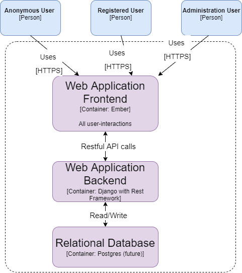

# User Stories
Following are the user stories followed by *acceptance criteria* (in *italics*) for ***biblinote*** app:

1. As an **administrator**, I want to **edit/delete users** so I can **manage users**.
    + *Given there is an admin account and users are registered, when admin logs in, admin can view users.*  
    + *Given there is an admin account, when admin is logged in, admin can edit registered user's information.*
2. As a new **user**, I want to **register** myself to the app so I can **use the app**.
    + Given the registration form is filled with an email address, when a user logs in to the app, one will view landing page.
3. As a **user**, I want to **create a bibliography entry** with a *research article* so I can **view or export it later**.
    + Given a user is logged in, when user clicks on "create" button and select "research article", user will be provided a form to fill with bibtex entry.
    + Given a user is logged in and the "create" form is filled with bibtex entry, when the user clicks on "submit" button, the interface will display a notification that the information has been saved.
4. As a **user**, I want to **create a bibliography entry** with a *web article* so I can **view or export it later**.
    + Given a user is logged in, when user clicks on "create" button and select "web article", user will be provided a form to fill with URL entry.
    + Given a user is logged in and the "create" form is filled with web URL entry, when the user clicks on "submit" button, the interface will display a notification that the information has been saved.
5. As a **user**, I want to **create a bibliography entry** with a *audio/video presentation* so I can **view or export it later**.
    + Given a user is logged in, when user clicks on "create" button and select "audio/video presentation", user will be provided a form to fill with link to audio/video entry.
    + Given a user is logged in and the "create" form is filled with audio/video entry, when the user clicks on "submit" button, the interface will display a notification that the information has been saved.
6. As a **user**, I want to **edit or delete existing bibliographies*** so I can **manage my resources that I own**.
    + Given a user is logged in, when user clicks on "bibliographies", the interface lists all the bibliographies saved by this user.
    + Given a user is logged in, when user clicks on a "bibliography", the interface allows user to edit or delete this record.
7. As a **user**, I want to **add a note** to existing bibliography so I can **save my notes and associate with the bibliography**.
    + Given a user is logged in, when user clicks on "add note" button and select existing "bibliography", user will be provided a note interface to write note about the bibliography. 
8. As a **user**, I want to **edit or delete a note** so I can **manage my notes that I own**.
    + Given a user is logged in, when user clicks on "notes" within "bibligoraphy" page, the interface lists all the notes saved by this user for this bibliography.
    + Given a user is logged in, when user clicks on a "notes" within "bibligoraphy" page, the interface allows user to edit or delete this record.
9. As a **user**, I want to **share a bibliography** so another user(s) is able to **view (read-only access)**.
    + Given a user is logged in, when user clicks on "share" in "bibliography" page, the interface allows user to add an email address to share the bibliography (and associated notes).
10. As a **user**, I want to **search my notes/bibliography** so I can find relevant references.
    + Given a user is logged in, when user clicks on "search" button with a term, the interface shows results of all the results from text search.

# Mis-User Stories
Following are the mis-user stories along with *mitigation criteria* for ***biblinote*** app:

1. As a **fake registered user**, one wants to **edit other user's information** so that email information and names can be stolen.
    + *The mitigation criteria includes having distinct role for users and limiting regular users to have access to one's own information only.*
2. As a **fake registered user**, one wants to **flood the database** with humongous data so that it will lead to overloading of resources and disruptions of the service.
    + *The mitigation criteria includes having fixed size for all the input data*
3. As a **fake registered user**, one wants to **share fake bibliography and notes** in order to lure people into clicking malicious links.
    + *The mitigation criteria includes blocking visibility of other users from fake registered user*
    + *The invitation to sharing of bibliography is allowed only if the recipient email address matches with a registered user*

# Diagrams

## Mockup diagrams
### Home Page

### Register Page

### Landing Page after successful login

### Bibliography Page

### Notes Page

### Add/Edit Bibliography Page

### Add/Edit Note Page

### Manage Users Page

## Architecture diagrams

### System Context Diagram

### Container Diagram

### Components Diagram

